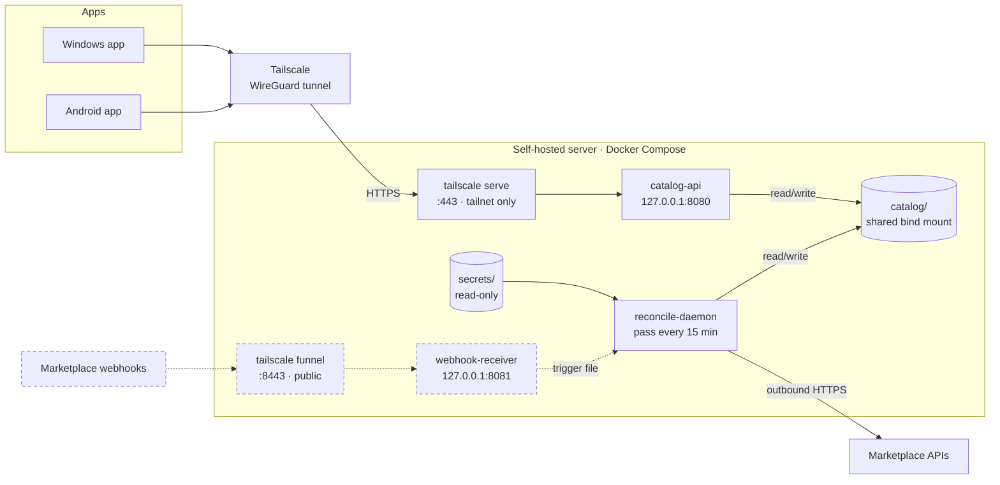
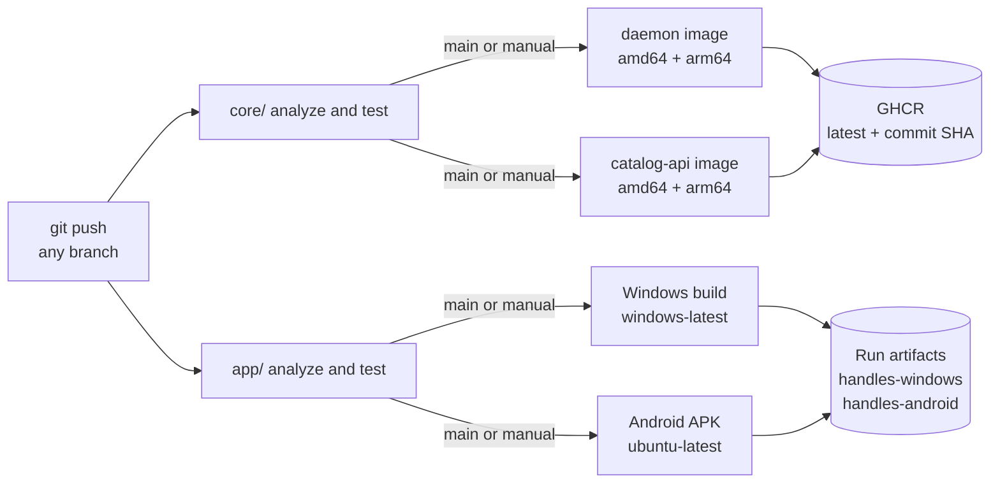

# Handles, self-hosted

*Case study: deploying the Handles backend on a self-hosted server. State as of 25 September 2026.*

Handles keeps one inventory catalog in sync across several marketplace accounts, some automated through official APIs and some monitor-only. This write-up covers moving its backend onto a self-hosted Linux server: the containers, the private network in front of them, the CI pipeline that produces every build, and the problems found and fixed along the way.

| | |
| --- | --- |
| **OS** | Ubuntu 26.04.1 LTS |
| **Runtime** | Docker 29.8.1, Compose v5.5 |
| **Access** | Tailscale 1.102, HTTPS, tailnet only |
| **Apps** | Windows desktop, Android |
| **State verified** | 2026-09-25 |

**Technologies:** Flutter · Dart (shelf) · Docker multi-stage builds · Docker Compose · GitHub Actions · GHCR · Tailscale / WireGuard · Claude Code agents

## How it was built

Most of the code and configuration was written by Claude Code agents working under my direction: one on my Windows workstation, the other on the server itself. I made the architecture and exposure decisions, ran everything that needed root, created the secrets by hand, and moved results between the two agents. Neither agent's claims were accepted on its word: each one was checked against the running system or the code, and the agents reviewed each other's work. Several findings below came out of that cross-checking.

## Architecture

*Solid: live. Dashed: built or planned, not live.*

Nothing on the server listens for app traffic on a LAN or public interface. The catalog API is published on localhost only, and the only way in is the Tailscale tunnel, terminated by `tailscale serve` with a real certificate. The API still requires a bearer token on every data request. The webhook path is the one planned public exception and is not live.

## The pipeline

Tests gate every build, and the slow builds run only on `main` or a manual trigger. Images push to GHCR with the workflow's own `GITHUB_TOKEN`, so there is no long-lived registry secret. GitHub's hosted Windows runner has Visual Studio installed, which is why my workstation doesn't need it.

| Job | Runs on | Trigger | Output | Status |
| --- | --- | --- | --- | --- |
| core/ analyze and test | `ubuntu-latest` | every push | pass or fail | In use |
| app/ analyze and test | `ubuntu-latest` | every push | pass or fail | In use |
| build-windows | `windows-latest` | `main` or manual, after app/ | `handles-windows` | Downloaded and run |
| build-android | `ubuntu-latest` | `main` or manual, after app/ | `handles-android` | In use |
| build-docker-image | `ubuntu-latest` | `main` or manual, after core/ | `handles-reconcile-daemon` | Not pulled by the server yet |
| build-catalog-api-image | `ubuntu-latest` | `main` or manual, after core/ | `handles-catalog-api` | Not pulled by the server yet |
| webhook-receiver image | – | – | – | No CI job yet; built on the server from source |

## Live state

*Verified 2026-09-25.*

The server builds images from source with the Compose file (`:local` tags). Each image is about 260 MB: a Debian slim runtime with git and a single AOT-compiled Dart binary, running as a non-root user.

| Service | State | Ports | Mounts | Memory | Policy |
| --- | --- | --- | --- | --- | --- |
| `catalog-api` | Running | `127.0.0.1:8080` | `catalog/` rw | 3.5 MiB | restart unless-stopped, logs 10 MB × 3 |
| `reconcile-daemon` | Running | none | `catalog/` rw, `secrets/` ro | 6.1 MiB | restart unless-stopped, logs 10 MB × 3 |
| `webhook-receiver` | Image built | `127.0.0.1:8081` | `catalog/` rw | – | not started |

Daemon log, latest pass: one account's adapter ready, two accounts skipped for missing credentials, 0 catalog items loaded, no changes made. Git sync and API git push are both off.

## Problems found and how they were fixed

### First deployment exposed a CI bug

- **Problem:** The API image built on my workstation but failed on the server with `"/pubspec.lock": not found`.
- **Cause:** `.gitignore` excluded every lockfile, but the Dockerfile copies it. Any clean checkout failed, including both CI image jobs.
- **Action:** Committed the lockfiles, which is Dart's guidance for applications, and deployed only the catalog API first.
- **Verified:** `/health` returned 200, and every data endpoint returned 401 with a missing or wrong token.

### Android release build had no network permission

- **Problem:** The release APK would install, then fail every API call.
- **Cause:** Flutter's template declares `INTERNET` only in the debug and profile manifests. `flutter run` merges those in, so the bug only showed in release builds.
- **Verified:** After the fix, I checked the built APK itself with `aapt2 dump permissions`.

### A firewall that wasn't protecting the API

- **Problem:** ufw was active, yet another machine on the LAN reached port 8080.
- **Cause:** Docker writes its own iptables rules for published ports, and they are evaluated before ufw's.
- **Action:** Bound the container to 127.0.0.1 and published it only through `tailscale serve`, which terminates HTTPS with a real certificate. The bearer token stays as a second layer.
- **Verified:** From a second machine: HTTPS over the tailnet works, requests without the token get 401, and the old plain-HTTP LAN address no longer answers.

### Reviewing a second agent's work

- **Problem:** The server-side agent added a webhook receiver for marketplace notifications. Its deployment doc said to expose it with `tailscale funnel` on port 443.
- **Finding:** Funnel is enabled per port, and `tailscale serve` already uses 443 for the private API. Following the doc would have made the catalog API public.
- **Action:** The receiver moved to 8443, the doc gained a `tailscale serve status` check, and the public route got a global limit of 30 requests per minute. The agent in turn corrected a claim of mine: one marketplace's route only logs notifications for manual review and makes no API calls. I checked that neither agent's pushes to `main` had overwritten the other's commits.

### Keeping secrets out of the repository

- **Practice:** The API token is generated on the server that uses it. Marketplace credentials are created by hand on the server from committed templates, set to `chmod 600`, excluded by `.gitignore`, and mounted read-only into the daemon.

## Known gaps

| Priority | Gap | Why it matters | Next step |
| --- | --- | --- | --- |
| High | No dry-run mode | Once the catalog has items and an account has credentials, the daemon changes live listings on its next pass. | A dry-run mode that logs intended changes without making them. |
| Medium | One webhook route isn't signature-verified | It checks that the signature header is present and well-formed, not that the signature is valid, so those notifications are logged for manual review and never acted on. | Full signature verification before the public route goes live. |
| Medium | No backups or alerting | With git sync off, the catalog directory on the server is the only copy, and nothing alerts if a container stops. | A scheduled backup of `catalog/` and a health check on `/health`. |
| Low | The server builds its own images | It has no read access to the repository, so updates are copied over by hand and built locally. | A read-only deploy key, then pulling the CI-built images from GHCR. |
| Low | The webhook image has no CI job | It is the only image the pipeline doesn't publish. | A job matching the other two image builds. |

## Skills this project exercised

- **Containers:** multi-stage Dockerfiles, non-root runtimes, Compose with shared bind mounts, restart policies and log rotation
- **CI/CD:** GitHub Actions with gated jobs, multi-architecture images, GHCR, cross-platform app builds
- **Private networking:** WireGuard via Tailscale, TLS termination, loopback binding, how Docker's published ports bypass ufw
- **Security review:** exposure checks from a second machine, secrets handling, rate limiting a public endpoint
- **Release engineering:** Flutter Windows and Android builds, manifest merging, inspecting built APKs
- **Working with AI agents:** two agents reviewing each other's work, every claim checked against the running system or the code

---

*Hostnames, network addresses, store account names and credentials are intentionally left out.*
